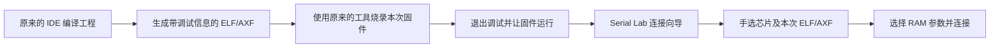

# Serial Lab 工程准备指南：Keil、STM32CubeIDE、CMake

使用 Serial Lab 不需要学习 CMake，也不需要把已有工程转换成 CMake。继续使用你熟悉的开发工具即可。

本指南针对 **SWD 运行态 RAM 调参**。普通串口收发与波形不需要 ELF；Native 串口调参需要接入对应协议，是另一条使用路径。

## 先看整个流程



**同一次构建的固件和 ELF/AXF 必须配套。** 不能烧录昨天的固件，却在插件里选择今天重新编译的文件。插件不会从 ELF 猜测芯片型号，也不会代替开发工具烧录。

| 你使用的工具 | 在插件中选择什么 | 常见位置，仅供参考 |
| --- | --- | --- |
| Keil MDK / µVision | `.axf` | `Objects/工程名.axf` |
| STM32CubeIDE（Eclipse 版） | `.elf` | `Debug/工程名.elf` 或 `Release/工程名.elf` |
| CMake + ARM GCC | `.elf` | 工程构建目录，路径由工程决定 |

`.hex`、`.bin` 通常不包含变量调试信息，不能代替 ELF 用于变量选择。把 `.bin` 改名为 `.elf` 也没有用。

## 方法一：Keil MDK / µVision

### 1. 打开原工程

在 Keil 中打开 `.uvprojx`（旧工程可能是 `.uvproj`），选择平时使用的 Target。无需安装 CMake。

### 2. 启用调试信息

打开 **Project → Options for Target… → Output**，勾选 **Debug Information**。记录这里的输出目录和可执行文件名称。

界面定位：

```text
Options for Target
└─ Output
   ├─ Select Folder for Objects…  ← 查看输出目录
   ├─ Name of Executable          ← 查看输出名称
   └─ Debug Information          ← 勾选
```

这是生成调试信息的设置；不等于在 Debug 页面选择某种探针。Arm Compiler 生成的 AXF 使用 ELF/DWARF 格式，但具体变量能否解析仍取决于实际调试信息和插件支持范围。[Keil 输出设置](https://www.keil.com/support/man/docs/uv4/uv4_dg_adsout.htm)、[Keil ELF/DWARF 说明](https://www.keil.com/appnotes/files/apnt_280_v2.0.pdf)

### 3. 重新编译并找到 AXF

执行 **Rebuild all target files**，确认编译成功。在刚才记录的输出目录中找到 `.axf`。不一定叫工程名，以 Output 设置和构建日志为准。

### 4. 烧录并结束调试占用

按照原来的 Keil 下载流程烧录本次固件。退出调试会话，释放探针，并确认固件正在运行。必要时按开发板复位键启动；电机或其他执行机构应按自己的固件流程保持在可控状态。

### 5. 在 Serial Lab 中选择文件

打开 **首次连接向导 → SWD**，选择探针和实际芯片，然后选择刚生成的 `.axf`。文件选择器支持 AXF，**不必改扩展名**。

如果出现参数列表，选择需要的变量并连接；如果无法解析，不要先转换 HEX/BIN，应检查 AXF 是否包含调试信息，并复制具体错误。

## 方法二：STM32CubeIDE

以下菜单针对常见的 Eclipse 版 STM32CubeIDE，不同版本的菜单名称可能略有变化。

### 1. 打开原工程并选择构建配置

在 Project Explorer 中选中工程，右键 **Build Configurations → Set Active**，选择准备烧录和测试的配置。

初次验证可以选择 **Debug**。如果工程已有调好的 Release 配置，不要为了插件随意改变优化等级；也可以在原配置中保留调试信息。

### 2. 检查调试信息

右键工程 **Properties → C/C++ Build → Settings**，在 **Tool Settings → MCU GCC Compiler → Debugging** 一类页面检查调试信息选项。

通常应选择非 None 的调试级别，例如 `-g` 或 `-g3`。也可在构建控制台核对编译命令：包含调试选项，且没有后面的 `-g0` 将其关闭。

调试信息与优化等级是不同设置。保留调试信息通常不要求关闭优化，也不需要添加任何上位机通信代码。

### 3. 编译并找到 ELF

执行 **Project → Build Project**。成功后展开当前配置的输出目录，通常可以找到：

```text
工程目录/
├─ Core/
├─ Drivers/
└─ Debug/
   └─ 工程名.elf
```

若使用 Release，则通常在 `Release` 目录；自定义输出目录以构建日志为准。文件不存在时，先处理编译/链接错误，不要选以前遗留的 ELF。

### 4. 烧录、释放探针，再连接插件

使用原来的 Run/Debug 下载流程烧录本次固件。结束 IDE 调试会话，确认 ST-LINK GDB Server、J-Link Server 等没有继续占用探针，并让固件运行。

在 Serial Lab 向导中手选芯片，选择同一次构建的 `.elf`，再选择参数并连接。STM32CubeIDE 的构建和调试相关操作可参阅 [ST 官方用户手册](https://www.st.com/resource/en/user_manual/um2609-stm32cubeide-user-guide-stmicroelectronics.pdf)。

## 方法三：已有 CMake 工程

**普通使用者不必修改 CMakeLists.txt。** 优先使用工程作者提供的构建按钮、脚本或预设。

### 1. 查看工程提供的构建方法

如果工程有 `CMakePresets.json`，在工程目录执行：

```powershell
cmake --list-presets
cmake --build --list-presets
```

第一条列出配置预设，第二条列出构建预设；两者名称不一定相同。优先查看工程 README 中的推荐命令。[CMake 预设官方说明](https://cmake.org/cmake/help/latest/manual/cmake-presets.7.html)

例如，**仅当工程确实提供相应名称时**，可以执行：

```powershell
cmake --preset Debug
cmake --build --preset Debug
```

`Release-SWD` 是某些工程自定义的预设名称，不是 CMake 内置名称，也不是插件的要求。不要将别人的构建命令直接套到自己的工程。

如果工程没有预设，按工程作者提供的方法构建。不要随意执行缺少 ARM 工具链配置的通用命令，否则可能误用电脑上的编译器。

### 2. 确认工程保留调试信息

已有 Debug 配置通常包含调试信息，但最终以实际编译选项和产物为准。如果插件提示缺少 DWARF，可以将下面这句话发给工程维护者：

> 请为当前固件构建保留 GCC 的 `-g` 或 `-g3` 调试信息，并保留未被 strip 的 ELF；需要调参的全局变量应有固定可写 RAM 地址。无需修改串口协议。

### 3. 找到 ELF 并烧录

从构建日志或输出目录找到本次 `.elf`。使用工程原有烧录工具烧录同一次构建的固件，退出调试占用，让芯片运行，然后在 Serial Lab 中选择该 ELF。

## 所有工程共用的代码要求

下面是最小示例，定义应放在一个参与编译的 `.c` 文件中：

```c
volatile float yaw_offset_deg = 0.0f;

/* 原有控制循环中持续读取，而不是只在初始化时复制一次。 */
float feedback_yaw = measured_yaw + yaw_offset_deg;
```

如果需要跨文件访问，在头文件中声明：

```c
extern volatile float yaw_offset_deg;
```

仅有 `extern` 声明不分配存储空间；变量必须有实际定义，并确实参与运行。结构体成员也可以，例如 `imu_yaw_test.offset_deg`。在类型声明中的 `offset_deg` 上右键时，新版插件会让你选择完整实例路径。

- 支持固定地址的 32 位浮点数、32 位有符号/无符号整数及 1 字节布尔值，以及受支持的结构体成员和一维固定数组元素。
- 宏、Flash 常量、被优化掉的变量、临时局部变量、指针解引用等不属于当前支持范围。
- 如果程序不断覆盖变量，插件写入的值会马上消失；建议提供独立调参变量。
- `volatile` 不解决 STM32F7/H7 的 D-Cache 一致性。启用数据缓存的工程，需要正确安排调参 RAM 区域或缓存维护，详见 [SWD 技术说明](SWD.md)。
- 参数只写 RAM，复位后通常恢复初始值；调好后将参数写回源代码默认配置并重新编译烧录。

## 常见现象

| 现象 | 优先检查 |
| --- | --- |
| 不知道自己的工程属于哪种 | `.uvprojx` 通常是 Keil；CubeIDE 工程常有 `.project/.cproject`；CMake 工程有 `CMakeLists.txt`。同一目录也可能包含多种工具配置。 |
| 只有 HEX/BIN | 回到原来的构建目录找 ELF/AXF，或请固件作者提供配套文件。 |
| 有 ELF，但变量列表为空 | 是否有调试信息；变量是否被优化掉；是否符合插件支持的类型及位置要求。 |
| ELF 与板上固件不匹配 | 重新烧录选定 ELF 对应的固件，不要混用不同构建的文件。 |
| 找不到芯片型号 | 向导中选择手动输入准确 target ID，并准备对应支持包；离线用户需导入已包含该型号的环境包。 |
| 提示目标未运行 | 结束断点暂停并让固件运行，再释放调试工具对探针的占用。 |
| 连接成功但修改无效果 | 检查算法是否持续读取此变量、是否被覆盖，以及缓存配置。 |

完成准备后，按照 [插件使用说明](使用说明.md) 连接。仍有问题时点击 **复制诊断报告**，同时说明开发工具、芯片型号、构建配置和具体变量表达式。

本指南依据工具文档和当前插件实现整理；不代表所有 Keil 编译器版本或所有工程的 DWARF 输出均已完成实机兼容性验证。
